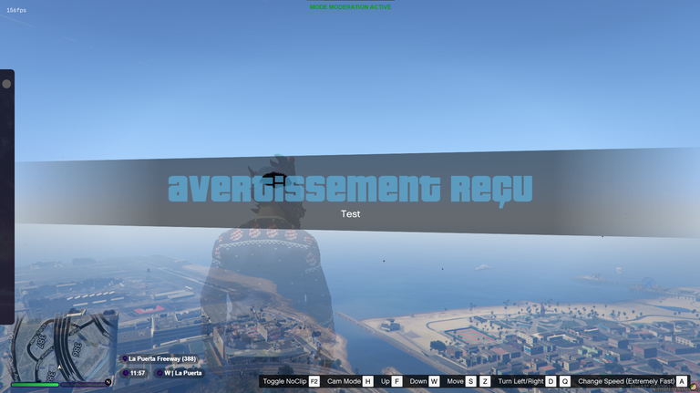

# Sanctions Configuration

The sanctions configuration is located at `config/module/cfg_sanctions.lua`. It controls how sanctions are presented to players when they are applied.

***

## 💬 Splash Message

```lua
UseSplashMessage = true,
```

If `true`, when a player receives a **warn** or a **commend**, a full-screen GTA V splash message appears on their screen with the sanction type and reason.

* A **warn** displays a blue splash message
* A **commend** displays a green splash message
* A **staff message** (sent via the report or admin chat) displays a purple splash message, optionally with the author's name

<figure><figcaption></figcaption></figure>

> 💡 The `ShowStaffMessageAsSplashMessage` and `ShowAuthorName` options in `cfg_main.lua` also affect how staff messages are displayed in this system.

***

## 👤 Show Ban Author

```lua
ShowBanAuthor = false,
```

If `true`, the name of the staff member who applied the ban is displayed in the ban screen shown to the banned player at connection.

If `false`, the ban screen only shows the reason, duration, and expiry date — the author remains anonymous.

***

## 📋 Available Sanction Types

The following sanction types can be applied from the in-game admin panel, via chat commands, or from the web dashboard:

| Type                 | Command                         | Description                                                               |
| -------------------- | ------------------------------- | ------------------------------------------------------------------------- |
| 📝 **Note**          | `/note`                         | Internal note visible only to staff. Not shown to the player.             |
| ⭐ **Commend**        | `/commend`                      | Positive commendation added to the player's profile with a splash message |
| ⚠️ **Warn**          | `/warn`                         | Formal warning added to the player's profile with a splash message        |
| 👟 **Kick**          | `/kick`                         | Removes the player from the server immediately                            |
| 🔨 **Temporary Ban** | `/ban [ID] [duration] [reason]` | Bans the player for a defined duration                                    |
| 🔒 **Permanent Ban** | `/ban [ID] p [reason]`          | Bans the player permanently                                               |
| 🌐 **Community Ban** | `/ban [ID] c [reason]`          | Bans the player across all servers of the community                       |

***

## ⏱️ Ban Duration Format

Durations are entered as a number followed by a letter code, as defined in `BanDurations` in `cfg_main.lua`:

| Code | Duration      |
| ---- | ------------- |
| `m`  | Minutes       |
| `h`  | Hours         |
| `d`  | Days          |
| `w`  | Weeks         |
| `mo` | Months        |
| `y`  | Years         |
| `p`  | Permanent     |
| `c`  | Community ban |

**Examples:** `30m`, `2h`, `7d`, `2w`, `1mo`, `1y`, `p`, `c`
