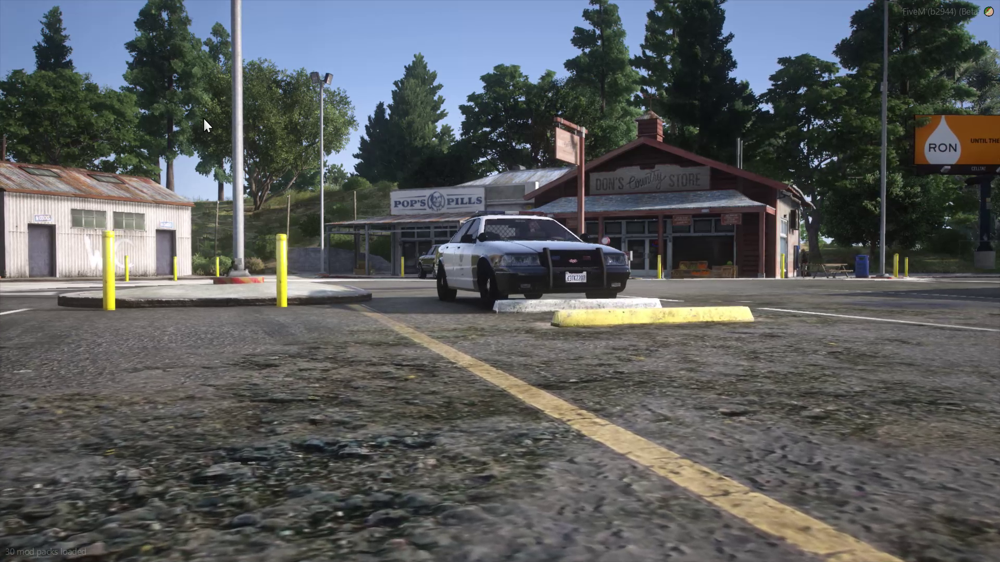
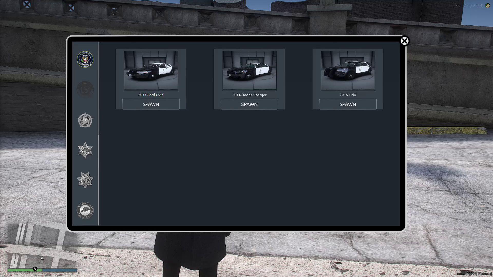

# 🚙 Madonne Car Spawner

It is often complicated for servers not using ESX, QB Core or any other similar framwork to offer their players a realistic vehicle spawning solution, without falling within the constraints of a life server. With Madonne CarSpawner, MadonneStudio offers all its servers a new innovative and customizable solution.

<figure><figcaption></figcaption></figure>

Our script allows you to allow your players to choose their vehicles via an intuitive interface and to have their vehicles appear near them, in one of the 11,000 parking spaces present in the game (having been listed by us). If no parking space is available nearby, an NPC will be responsible for bringing the vehicle to your players.

<figure><figcaption></figcaption></figure>

### Showcase Video


