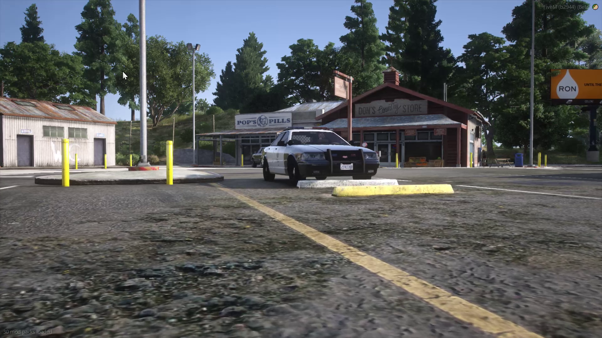
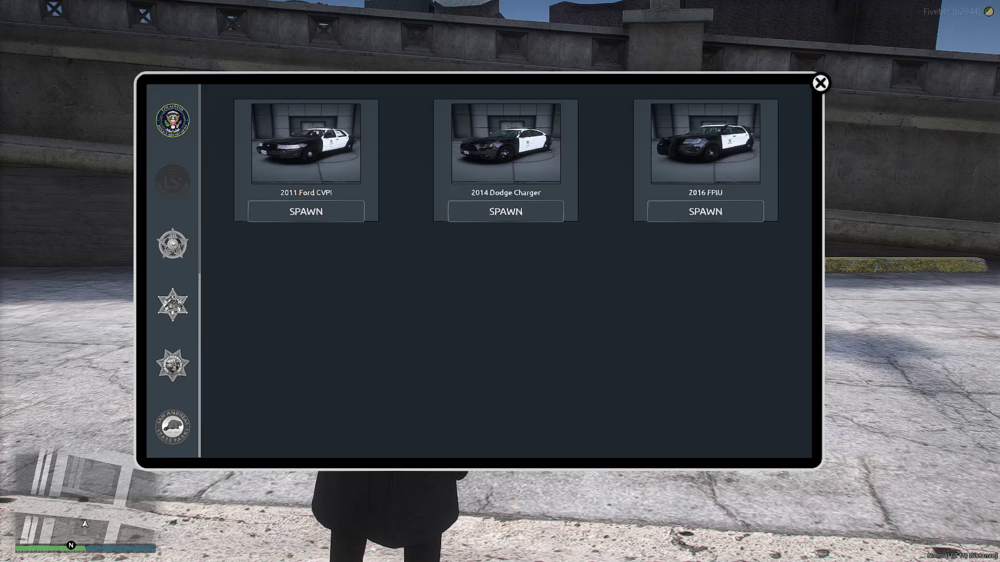

# 🚙 Madonne Car Spawner

Spawn your vehicles the right way! **Madonne Car Spawner** gives your players an intuitive and fully configurable vehicle spawning interface, with realistic NPC delivery, parking slot detection, department restrictions, and permission-based limits.



***

## 📖 About Madonne Car Spawner

Madonne Car Spawner allows players to browse and spawn their vehicles through a clean NUI interface — **without relying on ESX, QBCore, or any other framework**. Vehicles are delivered to one of the **11,000+ pre-listed parking slots** present in the game. If no slot is available nearby, a configurable **NPC mechanic** will drive the vehicle directly to the player.

Server owners can define **spawn areas** with markers and NPCs, restrict vehicles by **department**, configure **per-player vehicle limits** with VIP tier overrides, and fully customize categories, vehicle lists, and parking zones. A **badge system** allows locked vehicles to remain visible in the interface with a visual indicator.

<figure><figcaption></figcaption></figure>

***

## ✨ Main Features

* 🖥️ **Intuitive NUI Interface** — Players browse vehicles by category with photos, names, and livery previews
* 🅿️ **Smart Parking Detection** — Vehicles spawn on the nearest available slot out of 11,000+ pre-listed locations
* 🚶 **NPC Delivery System** — If no slot is found nearby, a configurable NPC mechanic brings the vehicle to the player
* 📍 **Spawn Areas** — Restrict menu access to defined map zones, with optional markers and NPC attendants
* 🏢 **Department Restrictions** — Each area can be limited to specific departments (LSPD, LSSD, SAFR…)
* 🔒 **Vehicle & Category Whitelisting** — Vehicles and categories can be locked behind a permission code
* 🏅 **Badge System** — Locked vehicles can remain visible in the interface with a custom badge (icon, color, label)
* 🚗 **Vehicle Limit per Player** — Configurable default limit with VIP-tier overrides
* 🎨 **Livery, Extras & Colors** — Define livery index, extras to enable/disable, and primary/secondary colors per vehicle
* ⚙️ **Framework Support** — Works standalone or with **ESX** (job-based permissions via `Framework = "esx"`)
* 🌍 **Full Translation Support** — All in-game strings are editable in a dedicated `TRANSLATIONS` table

<figure><figcaption></figcaption></figure>

***

## 🔗 Quick Links

* [📥 Installation](installation.md)
* [⚙️ Configuration](configuration.md)
* [❓ Common Errors](common-errors.md)
