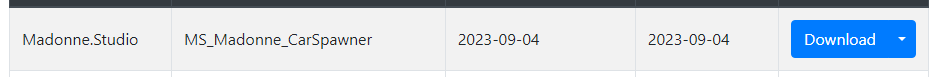

# Installation

1. After purchasing the resource on our store, log in to Fivem's KeyMaster site ([https://keymaster.fivem.net/](https://keymaster.fivem.net/)).
2. In the menu on the left, go to **Granted Assets** located in the **Server Owners** section.

<figure><figcaption></figcaption></figure>

3. In the list of resources, select the Download button corresponding to Madonne CarSpawner. This will download you a .zip file.

<figure><figcaption></figcaption></figure>

4. Open the archive you just downloaded. There you will find two folders named **MS\_Madonne\_CarSpawner**.
5. Drag this folders into your server's resources folder.
6. Since the resource is already configured and ready to use, all you have to do is edit your server's configuration file (often caller _server.cfg_) and add ensure _ensure MS\_Madonne\_CarSpawner_ at the bottom of it.

<figure><figcaption></figcaption></figure>

7. Start your server and enjoy your new script !

