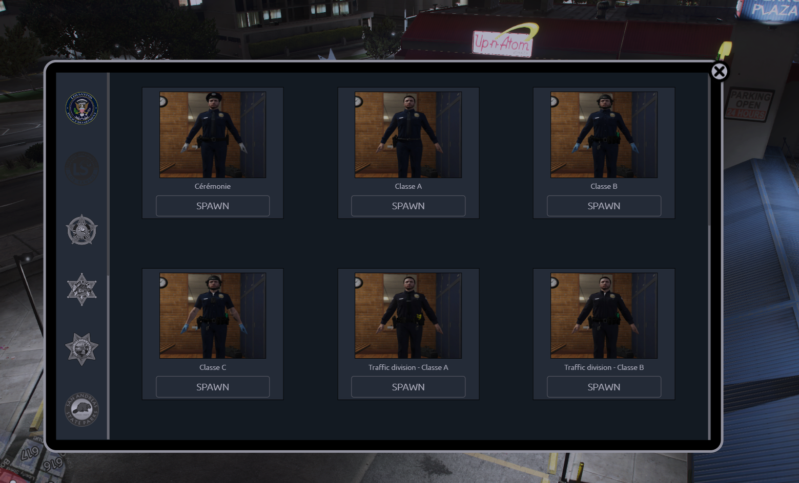

# 👕 Madonne EUP Menu

Dress your players the right way. **Madonne EUP Menu** gives your FiveM server a clean, fully configurable outfit equipping interface — with department restrictions, spawn areas, permission-based access, and gender filtering.

<figure><figcaption></figcaption></figure>

***

## 📖 About Madonne EUP Menu

Madonne EUP Menu allows players to browse and equip outfits through a simple NUI interface — **without any framework dependency**. Outfits are organized by category (department), each with its own logo and optional whitelist. Players can only see outfits matching their ped gender.

Server owners can define **spawn areas** with markers and optional NPC attendants, restrict outfit access by **department**, and fully control permissions via a dedicated `permissions.lua` file or any custom system.

***

## ✨ Main Features

* 🖥️ **Intuitive NUI Interface** — Players browse outfits by category with photos and names
* 🏢 **Department Restrictions** — Each spawn area can be limited to specific departments
* 🔒 **Outfit & Category Whitelisting** — Lock outfits or entire categories behind a permission code
* 👨👩 **Gender Filtering** — Outfits are automatically filtered by the player's ped gender (MP male / MP female)
* 📍 **Spawn Areas** — Restrict menu access to defined map zones with optional markers and NPC attendants
* 🎨 **Full Outfit Customization** — Configure every ped component (top, pants, shoes, hat, glasses, accessories…) and props per outfit
* 🔔 **Notification System** — Compatible with `notification`, `chat`, and custom handlers
* 🌍 **Full Translation Support** — All in-game strings are editable in a dedicated `TRANSLATIONS` table

***

## 🔗 Quick Links

* [📥 Installation](installation.md)
* [⚙️ Configuration](configuration.md)
* [❓ Common Errors](common-errors.md)
