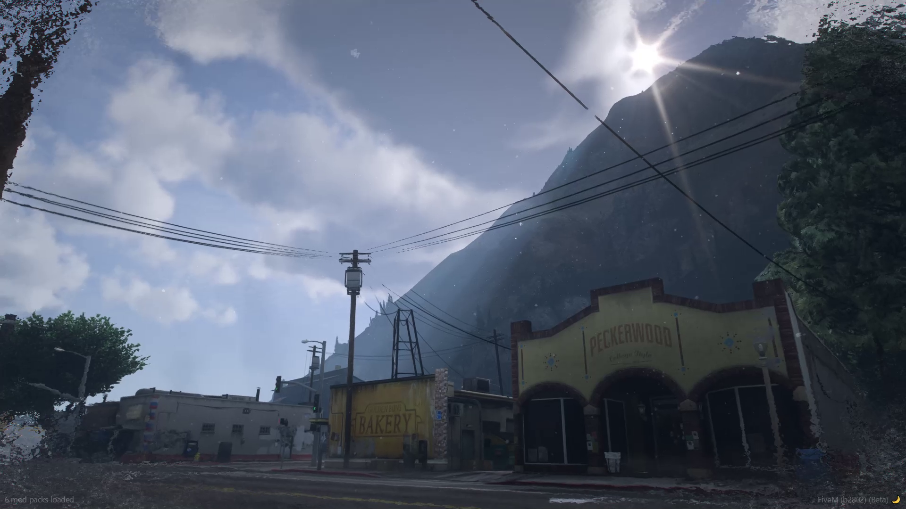
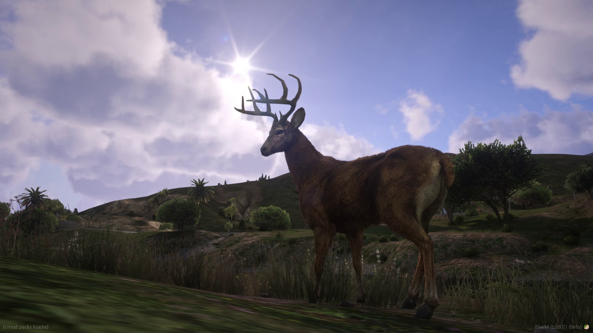

# ⛅ Madonne Seasons

Are you tired of the weather repeating itself in a simple way and without dynamism ? With MadonneSeasons, add a new dimension to weather management on your server.

<figure><figcaption></figcaption></figure>

### How to use it ?

Depending on your configuration options, the script will calculate the duration of four different seasons : summer, fall, winter and spring. Depending on these different seasons, the script will calculate a longer or shorter sunshine duration while taking into account the probabilities of weather conditions consistent with your wishes.

Your players will also have the option to launch a weather report, announcing the weather for the next day in-game.

<figure><figcaption></figcaption></figure>

### Showcase Video


