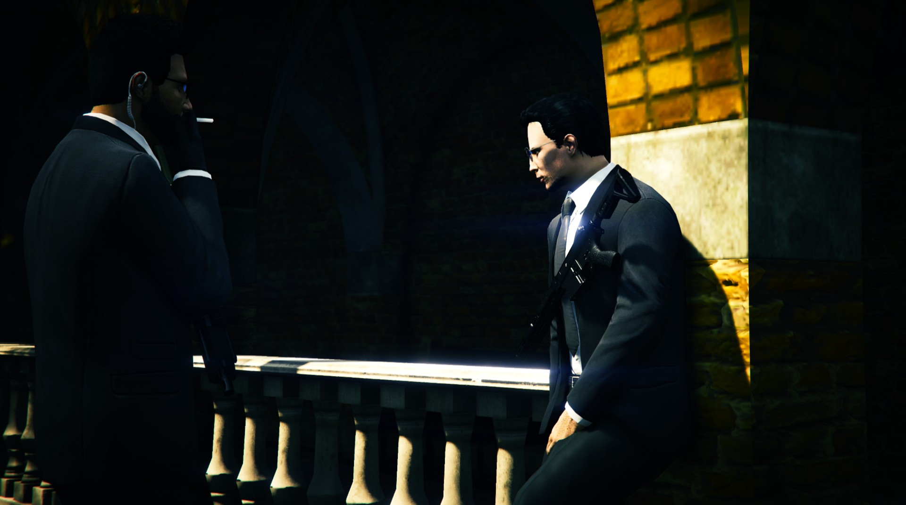
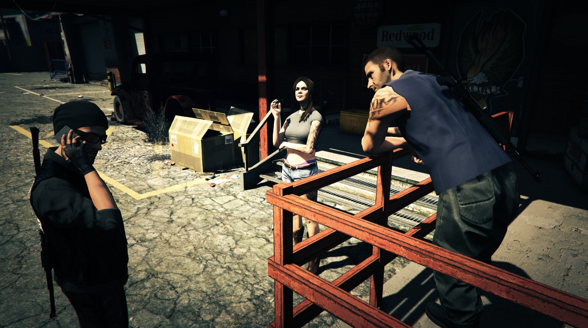
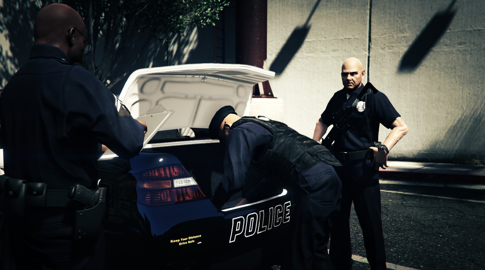

# 🔫 Wearable Weapon

Are you fed up with your shootouts always ending badly as weapons spawn in your player's hands when they come out of anywhere ?

**MadonneStudio has the solution for you !**

<figure><figcaption></figcaption></figure>

Thanks to our script, you can limit the use of heavy weapons, but also add a feature that will allow your players to carry their weapons on their chest or on their back.

The script therefore mainly allows you to force your players to retrieve an heavy weapon from the trunk of a vehicle before being able to use it.

<figure><figcaption></figcaption></figure>

### How to use it ?

As you approch a vehicle, use the weapon wheel to select a heavy weapon.

To redeposit th eweapon in a vehicle, equip yourself with the weapon, approach a vehicle again and equip yourself with a handgun or your fists.

To store your weapon on your chest or on your back, just equip a handgun or your fists, while being away from a vehicle.

To take the heavy weapon back in your hands, simply select it again in the weapon selection wheel.

<figure><figcaption></figcaption></figure>


If one of your moderation team members goes invisible (NoClip for example), the weapon hanging on the body will disappear while the person is invisible to other players.

On the death of a player, if a weapon is attached to him, this last will fall to the ground before disappearing, but will not be recoverable by other players.

